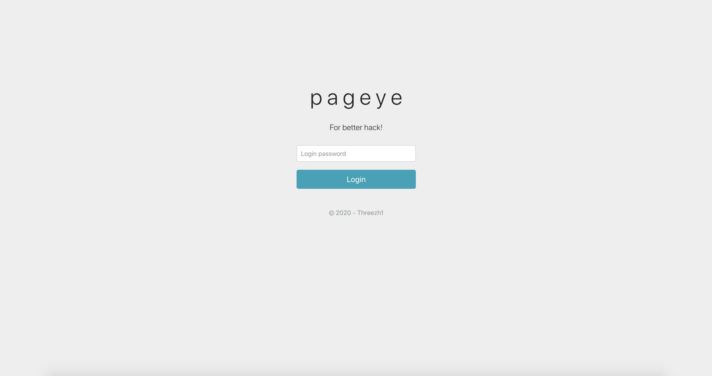
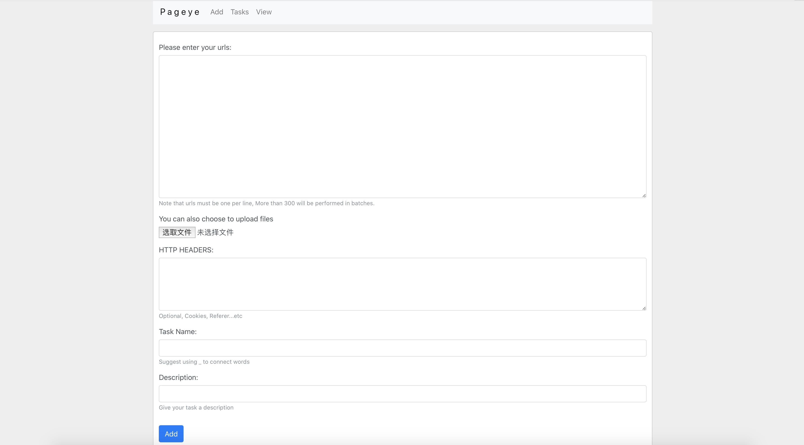
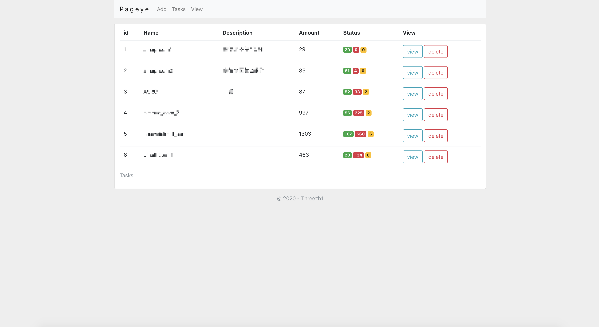
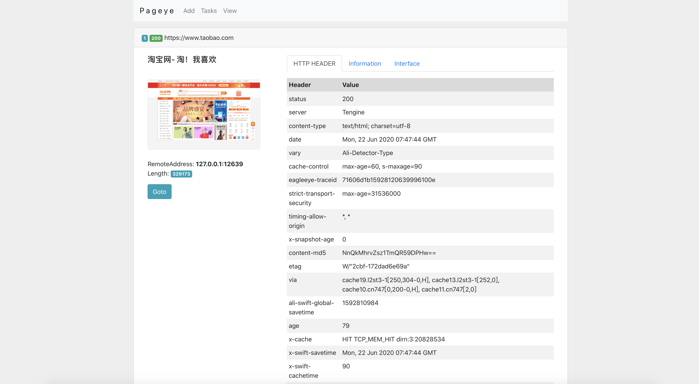

# pageye

Take a screenshot of the page based on the provided urls

根据提供的urls，对页面进行截图

这是之前学Node.js时挖的一个坑，原本的想法是从截图功能开始，增加资产收集、漏洞扫描功能。但至今没有动力将它再完善下去。

# Features

1. 对页面进行截图
2. 获取到网页源码进行敏感信息检测
3. 待增加...

# Usage

安装相关依赖：

```
npm install
```

修改Chromium地址(位置：`modules/crawler.js`)：

```
const pathToExtension = path.join('你本机的Chromium地址');
```

使用：

```
http://localhost:6001/
默认密码： threezh1
```

# Shot

- login



- main



- tasks



- view


